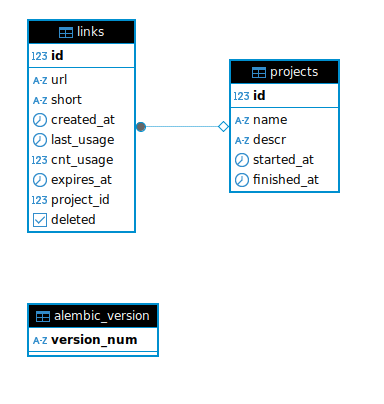

## **🔴 В сервисе реализован следующий функционал:**

1. **Создание / удаление / изменение / получение информации по короткой ссылке:**
  - `POST /links/shorten` – создает короткую ссылку.
  - `GET /links/{short_code}` – перенаправляет на оригинальный URL.
  - `DELETE /links/{short_code}` – удаляет связь.
  - `PUT /links/{short_code}` – обновляет URL.
2. **Статистика по ссылке:**
  - `GET /links/{short_code}/stats`
  - Отображает оригинальный URL, возвращает дату создания, количество переходов, дату последнего использования.
3. **Создание кастомных ссылок (уникальный alias):**
  - `POST /links/shorten` (с передачей `custom_alias`).
  - `alias` проверяется на уникальность.
4. **Поиск ссылки по оригинальному URL:**
  - `GET /links/search`
5. **Указание времени жизни ссылки:**
  - `POST /links/shorten` (создается с параметром `expires_at` в формате даты с точностью до минуты).

**Особенности сервиса**

1. Основное хранилище ссылок - PostgreSQL.

2. С помощью Alembic реализована миграция БД.

3. В методах `GET /links/{short_code}` и `GET /links/{short_code}/stats` при помощи Redis реализовано кэширование ссылок, по которым было более 10 переходов. Кэш сохраняется на 10 минут. При применении методов `DELETE /links/{short_code}` или `PUT /links/{short_code}`, кэш для данной ссылки удаляется. Также кэш удаляется, если в фоновой задаче Celery ссылка помечается как удаленная.

4. С помощью Celery реализованы 2 фоновые задачи, которые запускаются каждые 60 секунд:
    * Установка флага delete=True для ссылок, у которых истек срок годности (expires_at) или которыми не пользовались более 3-х дней.
    * Инкрементальное обновление полей `cnt_usage` (количество переходов по ссылке) и `last_usage` (последний переход).

5. Реализован дополнительный метод `GET links/deleted`, который возвращает информацию обо всех удаленных ссылках (url, short_code, дату создания, дату последнего перехода, количество переходов, название проекта).

6. Реализован дополнительный метод `GET /projects/{project_name}/stats`, который возвращает основную информацию по проекту: название, дату начала, дату окончания, общее количество ссылок в проекте, количество активных ссылок в проекте, количество переходов по ссылкам проекта.

**Запуск приложения**

`docker-compose up --build`

**Проверка корректности работы сервиса**

В файле `clients.py` написаны функции для проверки корректности работы API.

В папке `screenshots` лежит видеодоказательство работы сервиса.
